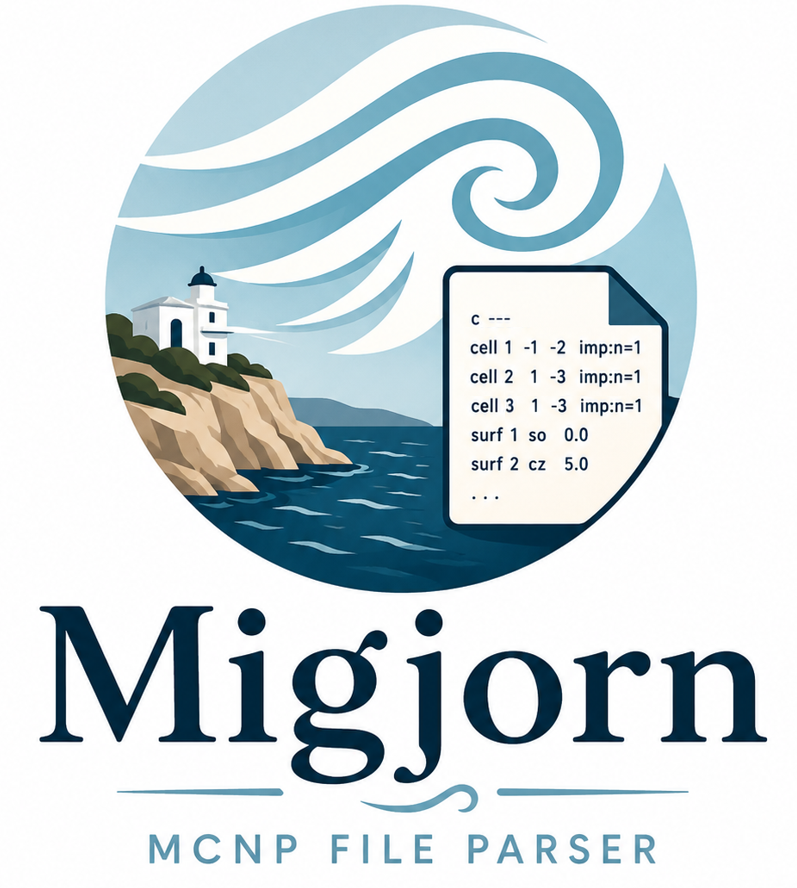

# Migjorn

<p align="center">
  
</p>

A fast, **lossless**, general-purpose MCNP input parser in Rust, with Python
bindings.

- **Lossless** — parse → edit → re-emit reproduces the input byte-for-byte
  except where you changed it (comments, spacing, and continuations are all
  preserved).
- **Fast** — a custom flat-arena syntax tree; the full 360 MB / 6.47 M-line
  reference model parses in ~0.8 s, and 1 M+ surfaces read well under a second.
- **General-purpose** — typed views of cells (with geometry expressions),
  surfaces, transforms, materials, and a generic view of every other data card.
- **Editable** — whole-geometry renumbering updates definitions *and* every
  reference (signed surfaces, `#n` complements, `LIKE n`) consistently.
- **Recoverable** — never panics on malformed input; collects diagnostics.

## Workspace

| Crate | Purpose |
|---|---|
| `migjorn-syntax` | Lexer + lossless concrete syntax tree (CST) + edit overlay |
| `migjorn` | Typed AST (`Model`, `Cell`, `Surface`, …) + renumbering |
| `migjorn-py` | Python bindings (PyO3 + maturin, `abi3` wheels) |

## Rust

```rust
use migjorn::Model;

let mut model = Model::parse(std::fs::read_to_string("model.mcnp")?);
for s in model.surfaces() {
    println!("{} {} {:?}", s.id, s.kind.mnemonic(), s.coeffs);
}
model.renumber_surfaces(|id| id + 1000); // defs + all references
std::fs::write("out.mcnp", model.to_source())?;
```

## Python

```bash
pip install migjorn
```

```python
import migjorn
model = migjorn.Model.from_file("model.mcnp")
print(model.surface(113).coeffs)
model.offset_surfaces(1_000_000)     # or model.renumber_surfaces({1: 100, ...})
model.save("out.mcnp")
```

To build from source instead, open the showcase notebook with
[uv](https://docs.astral.sh/uv/) — it builds the extension for you:

```bash
uv run --with "./crates/migjorn-py[notebook]" \
  jupyter lab crates/migjorn-py/examples/showcase.ipynb
```

The Rust API has an equivalent tour: `cargo run -p migjorn --example showcase`.

See `crates/migjorn-py/README.md` for the full Python API and more uv commands.

## Testing

```bash
cargo test                      # Rust unit + corpus snapshot tests
```

Regression corpus: drop any `.mcnp` file (or a one-card snippet) into
`crates/migjorn-syntax/tests/corpus/` and run `cargo insta review` — it is
asserted lossless and snapshotted automatically, no test code required.

Python tests: see `crates/migjorn-py/README.md#development-persistent-venv`
(`maturin develop --release` before every `pytest` run — the compiled
extension doesn't rebuild itself).

Design notes and benchmark results: `docs/`.
