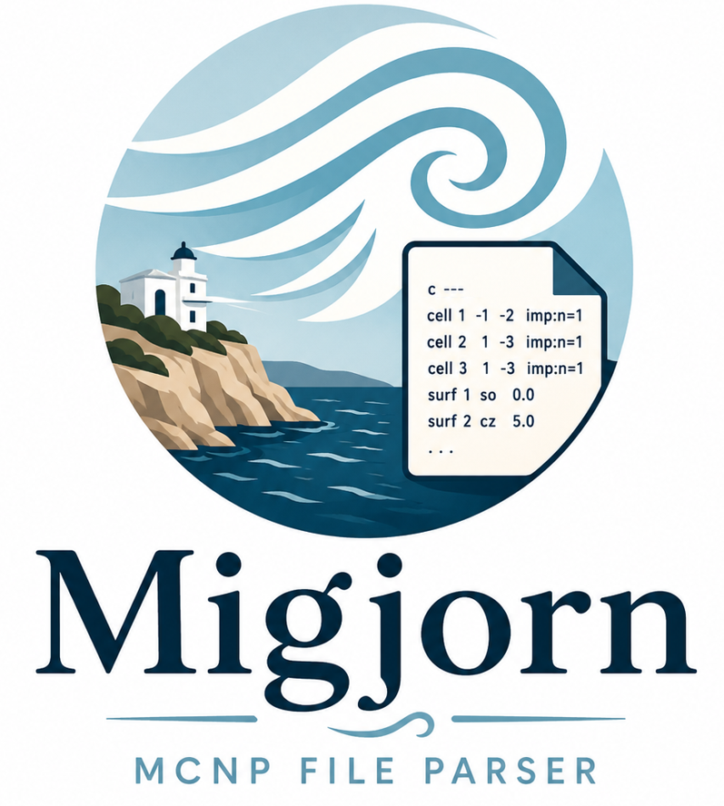

# Migjorn

<p align="center">
  
</p>

A fast, **lossless**, general-purpose MCNP input parser in Rust, with Python
bindings.

- **Lossless** — parse → edit → re-emit reproduces the input byte-for-byte
  except where you changed it (comments, spacing, and continuations are all
  preserved).
- **Fast** — a custom flat-arena syntax tree; the ~380 MB / ~1.09 M-card
  reference model parses in about a second, and edits, renumbering, and
  emission all stay sub-second — most well under a millisecond (see
  `docs/04-performance-budget.md`).
- **General-purpose** — typed views of cells (with geometry expressions),
  surfaces, transforms, materials, and a generic view of every other data card.
- **Editable** — whole-geometry renumbering updates definitions *and* every
  reference (signed surfaces, `#n` complements, `LIKE n`) consistently.
- **Recoverable** — never panics on malformed input; collects diagnostics.

## Workspace

| Crate | Purpose |
|---|---|
| `migjorn-syntax` | Lexer + lossless concrete syntax tree (CST) + edit overlay |
| `migjorn` | Typed AST (`Model`, `Cell`, `Surface`, …) + renumbering |
| `migjorn-py` | Python bindings (PyO3 + maturin, `abi3` wheels) |

## Rust

```rust
use migjorn::Model;

let mut model = Model::parse(std::fs::read_to_string("model.mcnp")?);
for s in model.surfaces() {
    println!("{} {} {:?}", s.id, s.kind.mnemonic(), s.coeffs);
}
model.renumber_surfaces(|id| id + 1000); // defs + all references
std::fs::write("out.mcnp", model.to_source())?;
```

## Python

```bash
pip install migjorn
```

```python
import migjorn
model = migjorn.Model.from_file("model.mcnp")
print(model.surface(113).coeffs)
model.offset_surfaces(1_000_000)     # or model.renumber_surfaces({1: 100, ...})
model.save("out.mcnp")
```

To build from source instead, build the extension with maturin and run the
self-contained showcase (no external model file needed):

```bash
cd crates/migjorn-py && maturin build --release --out ../../dist
pip install --force-reinstall --no-deps ../../dist/migjorn-*.whl
python crates/migjorn-py/examples/showcase.py
```

See `docs/README.md` for the full build & test workflow.

## Testing

```bash
cargo test                      # Rust unit + integration tests (round-trip, expectations)
```

Regression corpus: drop any `.mcnp` file (or a one-card snippet) into
`tests/corpus/` — it is asserted lossless by both the Rust and Python
round-trip suites automatically, no test code required. For structural
assertions (cell/surface counts, materials, geometry, …), add matching entries
to `tests/expectations.toml`.

Python tests: the acceptance suite lives in `tests/` (parsing, round-trip,
editing, stub drift) and the PyO3-boundary suite in `crates/migjorn-py/tests/`
— run both with `pytest tests crates/migjorn-py/tests -q` against a build of
this checkout's bindings (see `docs/README.md` for the build steps).

Design notes and benchmark results: `docs/`.
